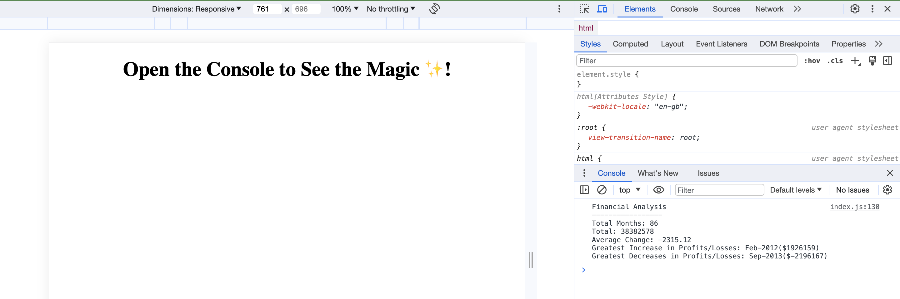

# Console-Finances

## Description 

This project is focues on creating code for analyzing the financial records of a company.
It presents a real-world situation in which we used JavaScript to calculate Profit and Loss. 
It uses JavaScript variables, arrays, for loops anf if statement to calculate the: Total Months, Net Total, Average Change, Greatest Increase in Profits/Losses and Greatest Decrease.

## Installation

This Project outcome sould be veiwed in the DevTools console.
Please follow [the link](https://porlowska.github.io/Console-Finances/), right clink the webpage and 'Inspect' the page, then open the console to see the outcome.

## Usage 

Thi project allowes us to analyzing the financial records of a company - Profit and Loss (PnL). Total Months, Net Total, Average Change, Greatest Increase in Profits/Losses and Greatest Decrease. 

## Credits

This project's outline was creared with whole pot-11. 
The final code was crated with collaboration with Jack Johnson.

## License

No Licence for this project

